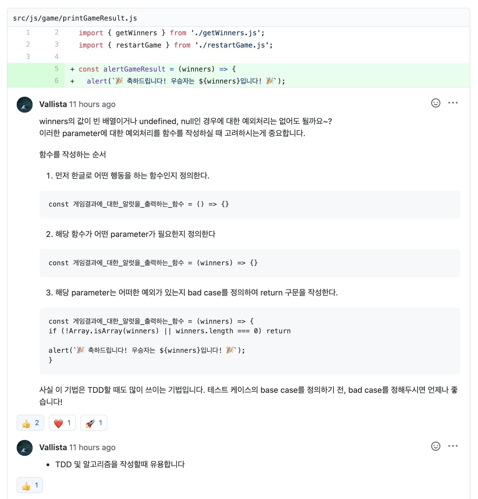
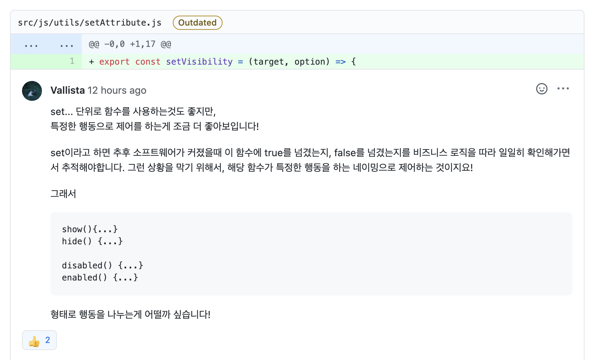
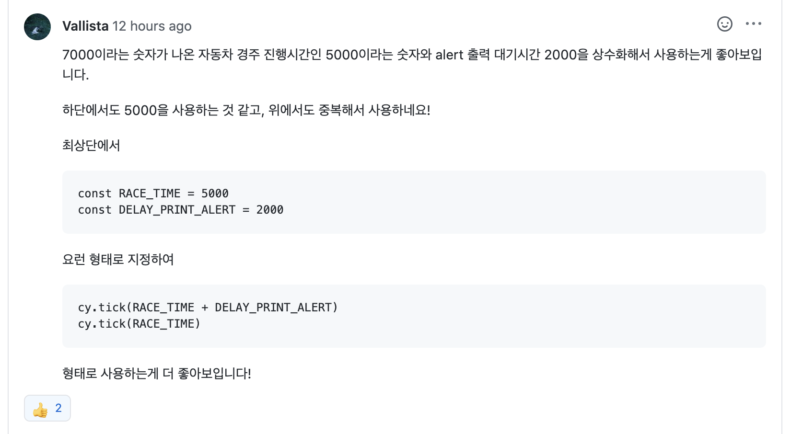
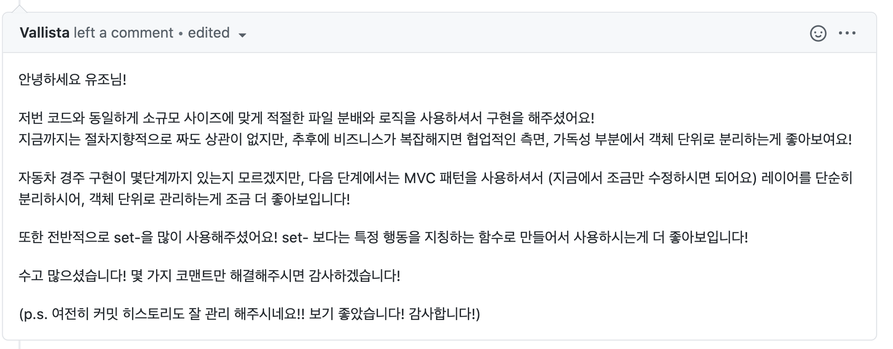

  <p align="middle" >
    
  </p>
  <h2 align="middle">level1 - 자동차 경주 게임</h2>
  <p align="middle">자바스크립트로 구현 하는 자동차 경주 게임</p>

## 0. 구현 요구사항

### 🎯🎯 step2

- [x] 자동차 경주 게임의 턴이 진행 될 때마다 1초의 텀(progressive 재생)을 두고 진행한다.
  - [x] 애니메이션 구현을 위해 setInterval, setTimeout, requestAnimationFrame 을 활용한다.
- [x] 정상적으로 게임의 턴이 다 동작된 후에는 결과를 보여주고, 2초 후에 축하의 alert 메세지를 띄운다.
- [x] 위 기능들이 정상적으로 동작하는지 Cypress를 이용해 테스트한다.

## 1. 진행하며 고민한 점

### cy.tick()과 cy.clock()

step2 요구사항에 `setTimeout`, `setInterval` , `requestAnimationFrame` 등을 사용해서 시간을 다루는 부분이 존재하다 보니 테스트를 위해서는 테스트 코드에서도 시간을 조작할 필요가 있었습니다. 따라서 테스트코드에서 시간을 다루기 위해 `cy.clock()`, 그리고 `cy.tick()` 과 `cy.clock()`를 다양하게 사용해봤습니다.


- 참고 링크 : https://docs.cypress.io/api/commands/wait.html#Syntax

cypress 공식문서를 보면 위와 같이 `cy.clock()`을 안티패턴으로 규정하고 있는걸 확인 할 수 있습니다. 그래서 `cy.tick()`과 `cy.wait()`를 모두 사용해 보되 모든 코드를 `cy.tick()`을 사용해서 작성할 계획이었습니다. 그러나 테스트 코드를 작성하고 테스트를 하면서 `cy.tick()`으로 해결하지 못하는 케이스를 만나게 돼서 `cy.clock()`을 많이 사용하게 됐습니다.

#### cy.tick()을 사용한 케이스

```js
it('자동차 경주 진행 중 턴마다 1초의 지연시간이 생기는지 테스트 한다.', () => {
  cy.clock();

  typeCarNameAndClickToSubmitButton();
  typeRacingCountAndClickToSubmitButton(1);

  // 첫번째 경기 진행시간 1000ms
  cy.tick(500);
  cy.get('#game-result-section').should('not.be.visible');
  cy.tick(500);
  cy.get('#game-result-section').should('be.visible');

  // 두번째 경기 진행시간 3000ms
  cy.get('#game-restart-button').click();
  typeCarNameAndClickToSubmitButton();
  typeRacingCountAndClickToSubmitButton(3);

  cy.tick(1500);
  cy.get('#game-result-section').should('not.be.visible');
  cy.tick(1500);
  cy.get('#game-result-section').should('be.visible');
}
```

#### cy.clock() 을 사용한 케이스

```js
it('자동차 경주 진행 중 지연시간마다 Anmiation이 출력되는지 테스트 한다.', () => {
  typeCarNameAndClickToSubmitButton()
  typeRacingCountAndClickToSubmitButton()

  cy.clock()

  // 경주 진행시간 5000ms
  cy.get('.spinner-container').should('be.visible')
  cy.wait(2000)
  cy.get('.spinner-container').should('be.visible')
  cy.wait(2000)
  cy.get('.spinner-container').should('be.visible')
  cy.wait(1000)
  cy.get('.spinner-container').should('not.be.visible')
})
```

위와 같이 `cy.clock()`과 `cy.tick()`을 모두 사용해 테스트 코드를 작성했습니다. `cy.wait()`를 사용하면 편하게 테스트코드 작성이 가능하지만 `cy.wait()`의 경우 실제 cypress에 지연시간이 생기면서 테스트 시간이 길어진다는 단점이 있습니다. 또한 공식문서에 Anti-Pattern으로 나오기도 해서 최대한 사용을 지양하기 위해 노력했습니다. 그러나 실제 테스트 구현시 `cy.wait()`로 실제 레이턴시를 지연시켰을 때는 실행이 되는데 `cy.tick()`으로 네이티브 시간을 움직였을 때 안 되는 케이스가 여럿 발생하고 있습니다.

공식문서에 설명된 내용만으로는 `cy.wait()`로는 되는데 `cy.tick()`으로는 안 되는 명확한 이유를 찾기 힘들었습니다. 이런저런 삽질을 하며 고생을 했지만 아직 네이티브 시간을 움직이는 `cy.tick()`과 cypress의 레이턴시를 지연시키는 `cy.clock()`의 명확한 차이를 경험적으로만 느끼고 있습니다. 앞으로 경험을 더 쌓고 레퍼런스를 찾아보며 이 부분에 대해 명확히 알고 가야겠다고 생각했습니다.

## 2. 코드 리뷰 및 피드백

### 2-1. 함수를 작성하는 방법(Bad Case / Base Case)



`alert` 메세지를 작성하는 함수에서 예외처리와 관련된 피드백을 받았다. 예외처리에 대한 피드백도 좋았지만 피드백 내용 중 함수를 작성하는 순서에 대한 내용이 정말 좋았습니다.

1. 한글로 함수를 정의하고
2. 해당 함수의 parameter를 정의하고
3. bad case를 정의하고
4. base case를 정의하고
5. 한글을 영어로 바꾼다.

지금까지 함수를 작성하면서 위와 같은 과정을 거친 적이 한번도 없었습니다. 그 때 그 때 되는대로 만들어왔는데 피드백 받은 내용을 바탕으로 함수를 작성하는 의식적인 연습을 계속 해봐야겠다고 생각했습니다.

### 2-2. 함수의 네이밍과 역할 분리



step2를 진행하면서 기존 `toggleVisibility()`, `toggleDisabled` 같은 `toggle-` prefix로 명명한 함수들을 `setVisibility()`, `setDisabled()`과 같이 `set-` prefix로 변경했습니다.

기존 `toggle-` prefix보다 `set-` prefix의 가독성이 더 좋다고 생각했습니다. 하지만 리뷰어 분의 피드백처럼 `set-`을 사용하면 로직을 따라가면서 추적해야 하는 문제가 있다는 점을 지적해주셨습니다. 실제 작은 규모의 소프트웨어를 작성하면서도 `set-`의 인자가 헷갈려서 찾아본 적도 있었지만 함수의 문제라고는 미처 생각을 못 하고 있었습니다.

기존 `set-` prefix로 작성한 함수들의 역할을 분리해 아래와 같이 변경했습니다.

```js
export const hideElement = element => {
  return element.setAttribute('hidden', true)
}

export const showElement = element => {
  return element.removeAttribute('hidden')
}

export const disabledElement = element => {
  return element.setAttribute('disabled', true)
}

export const enabledElement = element => {
  return element.removeAttribute('disabled')
}
```

함수들의 역할을 쪼개니 전체 코드의 가독성이 훨씬 높아지고 함수의 역할을 명확하게 할 수 있었습니다. `toggleAttribute()` 같은 메서드를 만들면서 함수의 재사용에만 집중해서 오히려 가독성이 떨어지는 함수를 만든게 실책이었습니다. 앞으로는 재사용성을 생각하기 이전에 하나의 함수가 하나의 역할만 수행하도록 하는 단일 책임의 원칙에 집중해야겠다는 생각을 했습니다.

### 2-3. test code의 상수와 함수 분리




기능을 구현할 때는 상수와 함수를 분리하는걸 계속 염두에 두고 코드를 작성하는데 아직 테스트 코드를 작성할 때는 정신없이 작성해서 그랬는지 그런 부분이 자연스럽게 이뤄지지 않고 있습니다. 앞으로는 테스트 코드를 리팩토링 할 때 잊지말고 꼭 체크해야겠다는 생각을 했습니다. 테스트에서 중복되서 사용되던 부분을 아래와 같이 함수로 분리 했습니다.

```js
const waitRaceTime = (raceTime = TEST_RACE_TIME) => {
  cy.clock()
  cy.wait(raceTime)
}

const waitTimeAndcheckElementShow = (time, element) => {
  cy.clock()
  cy.wait(time)
  cy.get(element).should('be.visible')
}

const waitTimeAndcheckElementHide = (time, element) => {
  cy.clock()
  cy.wait(time)
  cy.get(element).should('not.be.visible')
}
```

### 2-4. MVC패턴, 레이어와 객체



리뷰어 분의 코멘트를 보고 MVC패턴과 레이어 패턴에 대해 다시 한번 찾아봤습니다. 다른 크루들이 MVC 패턴을 많이 사용행하고 있는걸 봤는데 제 코드를 조금만 수정하면 MVC패턴으로 바꿀 수 있다는 생각은 해보지 못 했습니다. 다시 코드를 보니 View와 Model, Controller가 어느정도 나뉘어져 있다는 생각이 들었습니다. 다만 특정 함수에서 V와 M의 역할을 둘 다 수행하고 Controller에서 View의 역할을 수행하는 등 MVC에 부합하지는 않지만 마냥 어렵게만 느껴졌던 MVC가 조금은 눈에 보이는거 기분이었습니다.

다음 로또 미션에서는 리뷰어 분의 피드백처럼 MVC패턴을 적용해 객체로 상태관리를 해봐야겠다는 생각을 했습니다.

## 3. 링크

- [전체 코드 링크](https://github.com/yujo11/javascript-racingcar/tree/step2)
- [PR 링크](https://github.com/woowacourse/javascript-racingcar/pull/25)
